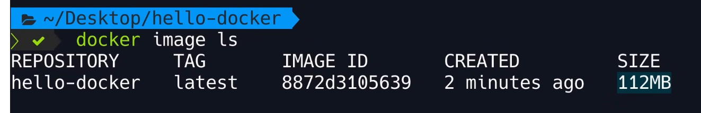

# Docker explaination 
Docker is a plateform for building, running, shipping consistently across different machine or environment.

Docker allow packaging on every dependecies or configuration.
It isolate environment by app.


```bash
docker-compose up
```

remove app : 
```bash
docker-compose down --rmi all
```


## Virtual machine vs Containers :

A `Virtual machine` (VM) is an abstraction of a machine (physical hardware).
We can have multiple VM on the same physical machine. All handle by an hypervisor (VirtualBox, VMware, ...)
Benefits: run app in isolation.
Pb : - Each VM need full copy of full-blown OS.
     - Can be slow to start (loadding all OS like physical PC)
     - Ressource intensive (Use a slice of the actual physical ressource RAM, CPU, ...)


A `container` is an isolated environment for running app.
It allow same benefits than VM, like running multiple apps in isolation.
But the also offer : - Lightweight 
                     - Share the OS of the host (we only have to monitor one OS, the host one.)
                     - start quickly 
                     - no need to use hardware ressources

Basically Docker container offer the same service as VM but in a much efficient way. If you ever need to set isolate environment without the need of a full-blown OS docker is by far a greater choice.


## Docker architecture :

Docker use a `client` and `server` architecture communication throught a REST API. 
The `server` is call the *Docker engine*, it take care of *building* or *running* docker container. Technically a `container` is just a **process**.


## Docker installation : 

You can install from [here](https://docs.docker.com/get-started/get-docker/)
Check correct installation and version with : 
```bash
docker version
```

## Development workflow with Docker : 

To run an app using Docker we need a `DockerFile`. It's plain text file that include all instructions needed by Docker to package this application into an `image`.

An *image* contain everything the application need to run.
It contain : - A cut-down OS
             - A runtime environment (Node, Python runtime, ...)
             - All the app files.
             - Third-party librairies
             - environment variables 


Once we have an `image` we tell Docker to start a `Ccontainer` using that `image`. A container is a special process with it's own file system provide by the `image`. The app run inside this `container`.

So instead of running directly inside a typical process like : 
```bash 
run My-app
```
We run it inside a container an isolated environment : 
```bash
docker run My-app
```

Once we have this `image` we can **push it** to a Docker registry, `Docker Hub`. It's like Github and Git, it's a storage for `Docker images`. And as long as the other machines have Docker installed we can **pull it** to any other machines. 


### Workflow in action :
 
We are gonna use Dockerfile and place each instruction we want to do to start our app inside this Dockerfile.

We start by using an **official image** for our environment. We can find it on `Docker Hub`. And we can specify the distrubution we wanna use with a `tag` specify by `:`.
```Dockerfile
FROM python:3.12-alpine #runtime env:distribution
```
 
Then we need to copy our program files. we first set the origin then the destination of the copy (like the bash command)
```Dockerfile
COPY . /app
```

TO run our app we need to specify the command we wanna use to run it. But you the emplacement of the files after you have copied them.
```Dockerfile 
CMD node /app/app.js 
# or 
CMD ["python", "server.py"] 
# all depend on the command you use to run your program
```

So you have to adapt path of files location. Unless you specify the *working directory*.
```Dockerfile 
WORKDIR /app 
# you can then do 
CMD node app.js 
```
After the `WORKDIR` instrution, all the following instructions assume we are inside the working directory.

Once the instruction are all set inside the Dockerfile. We can run our app. Or to be exact we can almost run our app with Docker.
We first need to **build** the application, we need to **packages** our app.
```bash
docker build ...
``` 
We need to set a name to identify our image. We can use 
```bash
docker build -t [name]
```
And we are not done yet, we need to specify where Docker can find a Dockerfile.
```bash
 build -t [name] [Dockefile location]
```
To see all created images we can do : 
```bash
docker images
# or 
docker image ls 
```
The output should look like this : 


The `Repository` is the tag we gave for the build.
The `TAG` in the current version of the app inside the image, each image can contain a different version of our app we can identify with tags. Default is `latest`.
The `IMAGE ID` is the unique identifier of the image.
We can found detail history of an image with this id using : 
```bash
docker image history [id]
```
Or detail information with 
```bash
docker image inspect [id]
```

`CREATED` is the time since creation (not a big surprise).
The `SIZE` is obviously the size of the image.

You can then run the image we the command we talk about before.
```bash
docker run [name]
```
The beauty of this is that you can do this anywhere since all the file are contain inside the image.

Like we usually do with Git and Github we can push our image to `Docker Hub` with : 
```bash 
docker image push [name]
```

You can then find it on `Docker hub` and pull it on any machine with : 
```bash 
docker image pull [name]
```

You can test it on this site before hand, [here](https://labs.play-with-docker.com/)


Bonus command : 
- To remove and image you can use : 
```bash 
docker image rm [image]
```
- To save an image to a tar archive you can use : 
```bash 
docker image save [image]
```
- To add a TARGET_IMAGE that refer to a SOURCE_IMAGE you can use :
```bash
docker image tag SOURCE_IMAGE[:tag] TARGET_IMAGE[:tag]  
```

Look [here](https://docs.docker.com/reference/cli/docker/) for all the command you can found.
 
### Volumes : 

Volumes are persistent data stores for containers, created and managed by Docker. You can create a volume explicitly using the docker volume create command, or Docker can create a volume during container or service creation.

When you create a volume, it's stored within a directory on the Docker host. When you mount the volume into a container, this directory is what's mounted into the container. This is similar to the way that bind mounts work, except that volumes are managed by Docker and are isolated from the core functionality of the host machine.

When to use volumes
Volumes are the preferred mechanism for persisting data generated by and used by Docker containers. While bind mounts are dependent on the directory structure and OS of the host machine, volumes are completely managed by Docker. Volumes are a good choice for the following use cases:

Volumes are easier to back up or migrate than bind mounts.
You can manage volumes using Docker CLI commands or the Docker API.
Volumes work on both Linux and Windows containers.
Volumes can be more safely shared among multiple containers.
New volumes can have their content pre-populated by a container or build.
When your application requires high-performance I/O.
Volumes are not a good choice if you need to access the files from the host, as the volume is completely managed by Docker. Use bind mounts if you need to access files or directories from both containers and the host.

